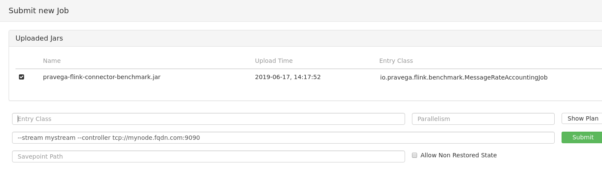

# pravega-flink-connector-benchmark
Pravega Flink Connector Benchmark

# Build

```bash
./gradlew jar
```

## Build With Specific Pravega Version

```bash
./gradlew -PpravegaVersion=0.6.0-50.ed9d955-SNAPSHOT clean jar
```

# Deploy

## Prerquisites

1. Pravega cluster (not standalone) is deployed. Note the Pravega version for the compatibility.
2. Flink cluster/standalone is deployed.

## Steps

1. Open Flink UI in the browser. Use the Flink's *master node* address and the port # 8081.
2. Go to the *Submit new Job* tab in the left menu.
3. Press the *Add New +* button.
4. Select the built jar in the open file dialog.
5. Upload the jar.
6. Specify the entry class for the selected job, the desired parallelism and arguments.
7. Press the *Submit* button.



# Jobs

* `io.pravega.flink.benchmark.MessageRateAccountingJob`
    Parameters (w/ default values):
    * `--scope="scope0"`
    * `--stream="stream0"`
    * `--controllerUri="tcp://127.0.0.1:9090"`
    * `--readTimeoutMillis`
